# Dawngrid

[中文](./README.zh-CN.md)

One login, one grid. Cluster, training, robots, and any UI already running hang on as plugins.

Identity, shell, gateway, and audit live in this repo. Domain products stay in their own. Do not put Pods or training runs in the host.

## What it does

- After login you land on the cell grid, with an island chrome and seven floors
- People, roles, orgs / projects, and audit
- Compile-time plugins: a native page, or a thin iframe around someone else's console
- Enable or disable a plugin at runtime without a rebuild
- Paste a URL and it becomes a cell; if the site refuses a frame, open it in a new tab
- Dawn, Ion, and Tide palettes, each with light and dark

## Screenshots

<details>
<summary>Shell</summary>

<details>
<summary>Sign in</summary>

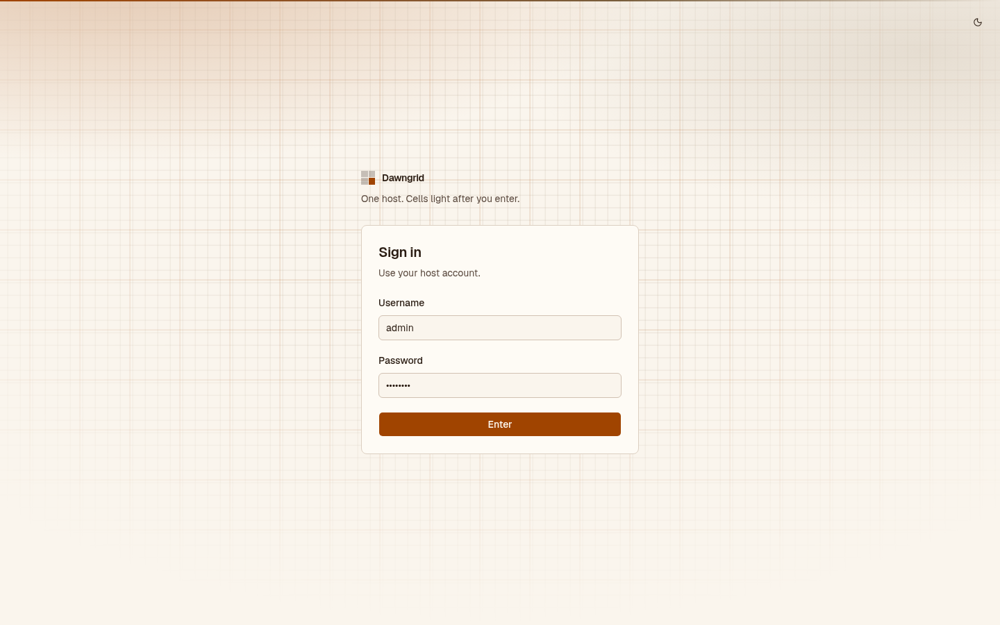

</details>

<details>
<summary>Cell grid</summary>

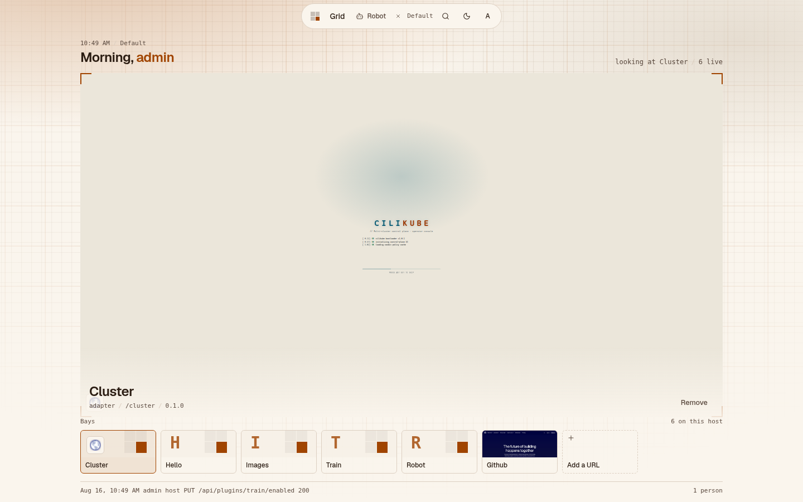

</details>

<details>
<summary>Cell grid, dark</summary>

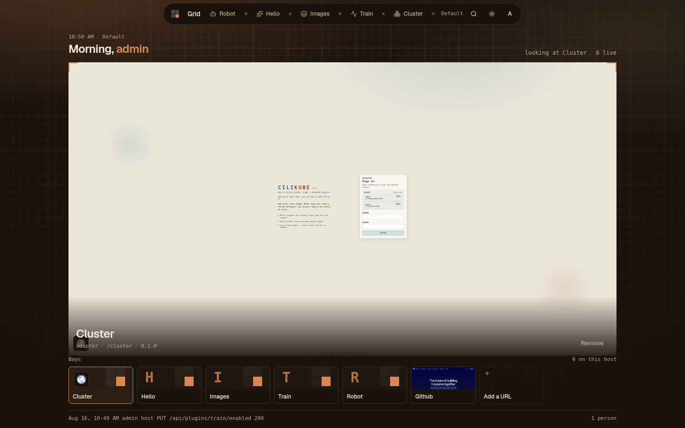

</details>

<details>
<summary>Layout</summary>

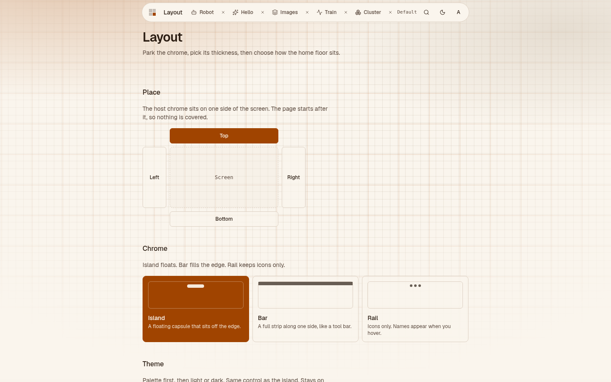

</details>

</details>

<details>
<summary>Plugins</summary>

<details>
<summary>Hello</summary>

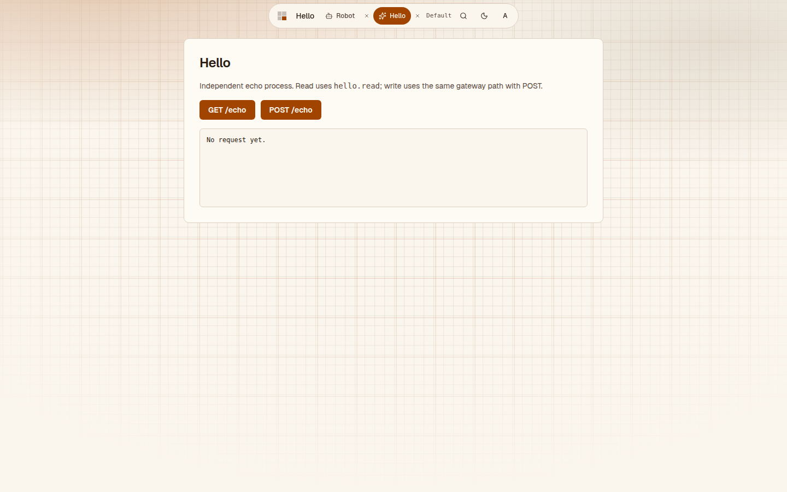

</details>

<details>
<summary>Images</summary>

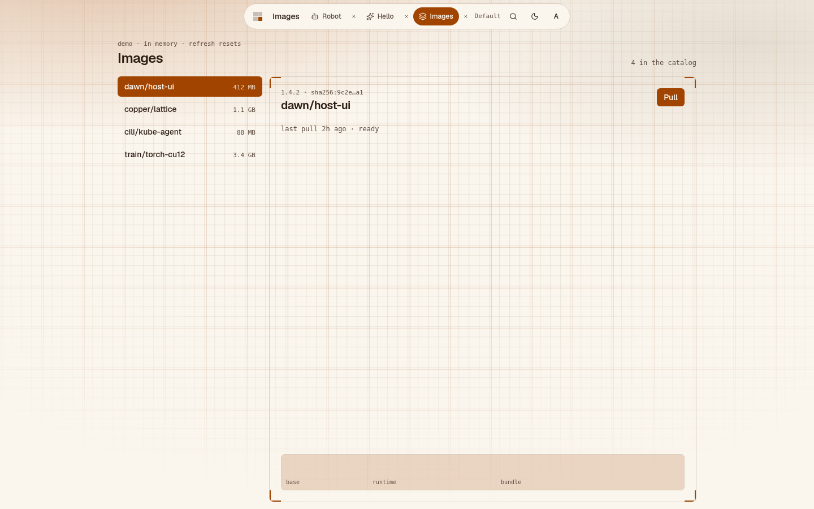

</details>

<details>
<summary>Train</summary>

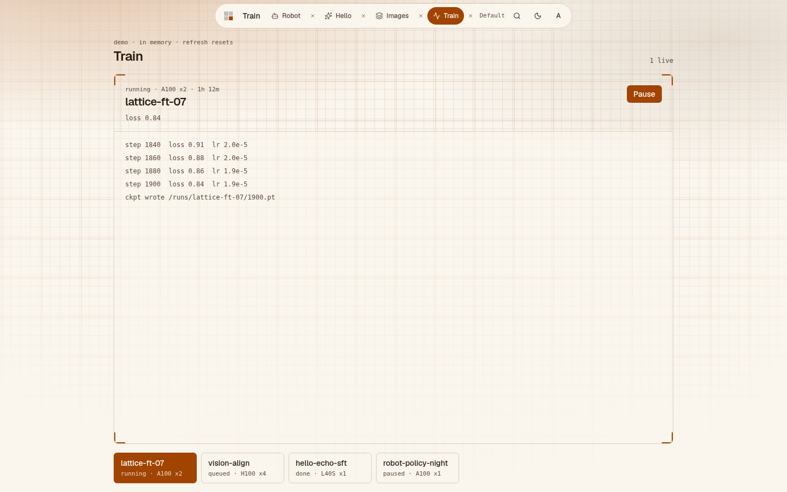

</details>

<details>
<summary>Robot</summary>

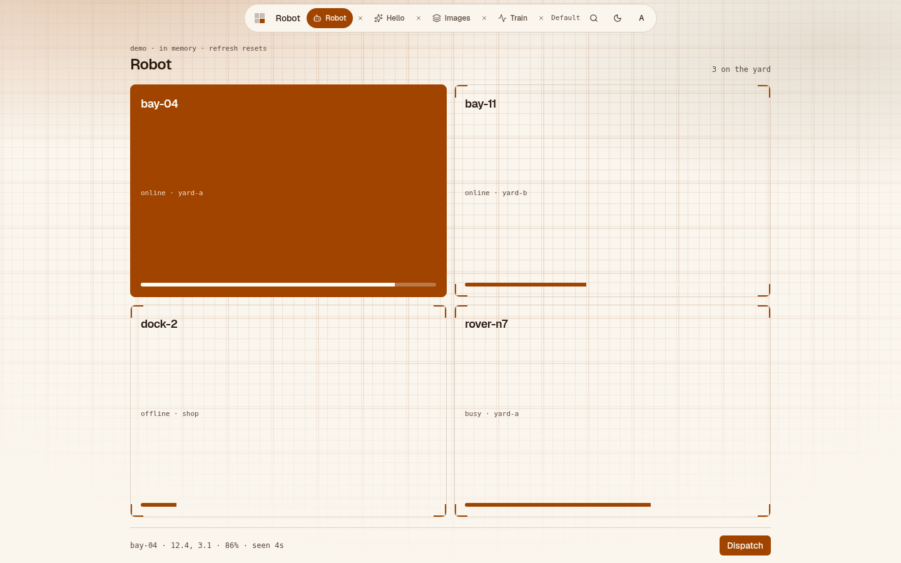

</details>

<details>
<summary>Cluster adapter</summary>

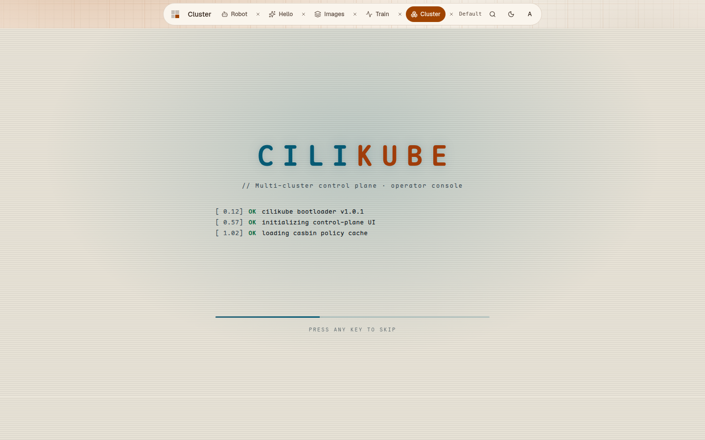

</details>

</details>

<details>
<summary>Host admin</summary>

<details>
<summary>Plugins</summary>

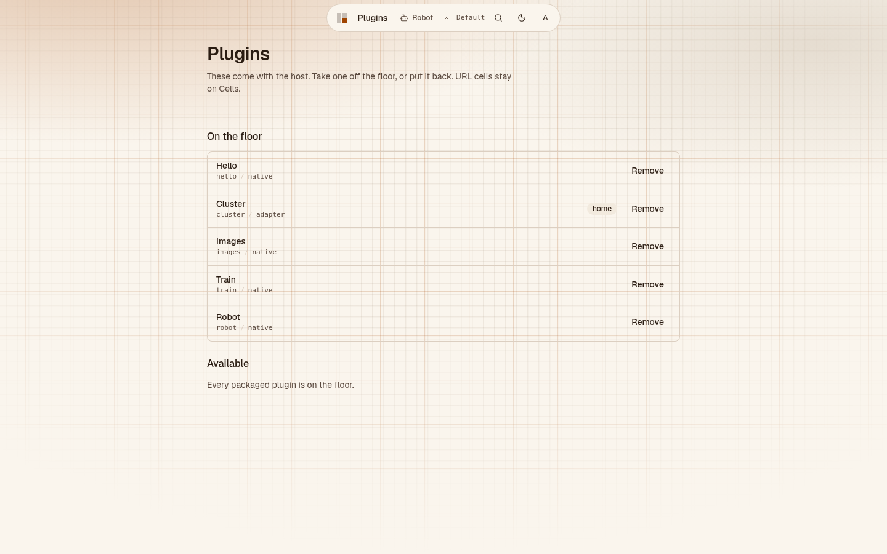

</details>

<details>
<summary>People</summary>

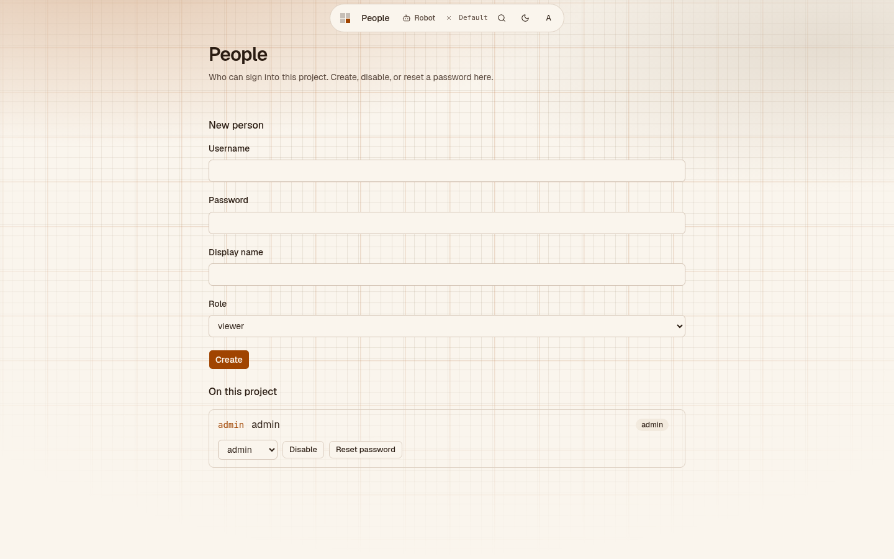

</details>

<details>
<summary>Roles</summary>

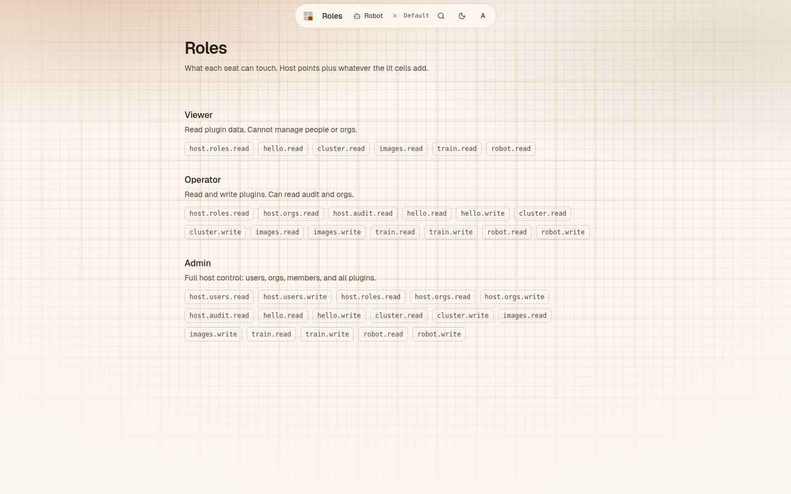

</details>

<details>
<summary>Orgs</summary>

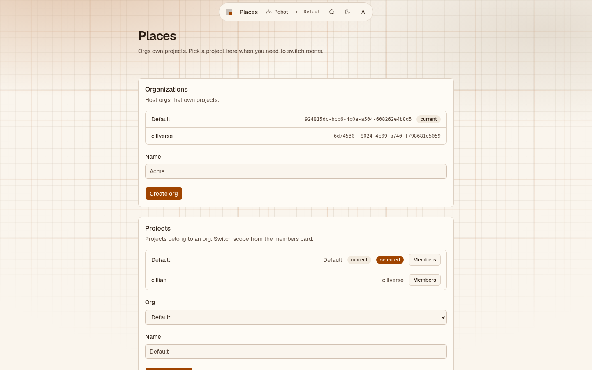

</details>

<details>
<summary>Audit</summary>

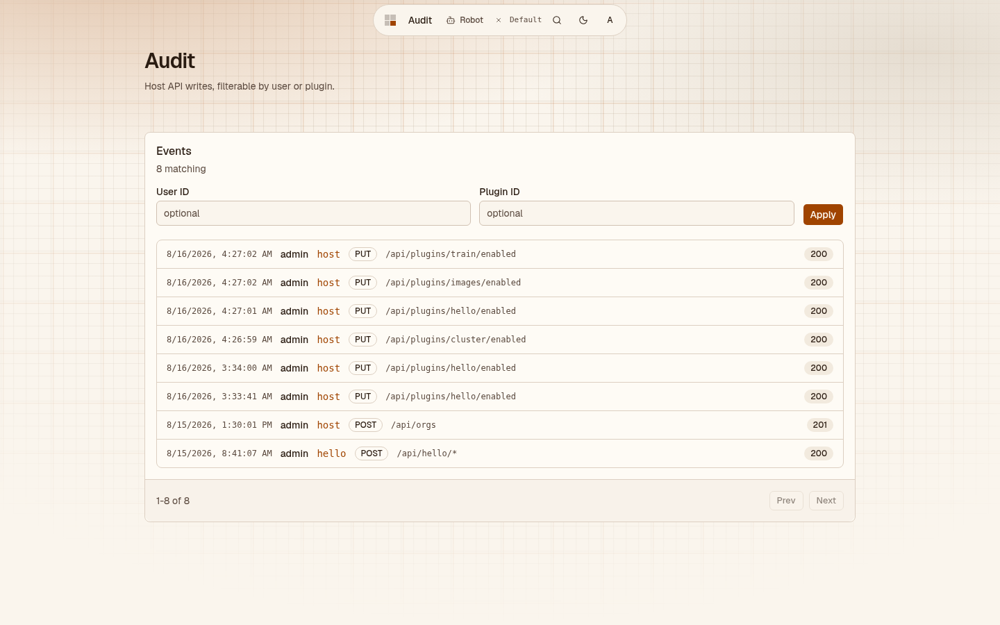

</details>

<details>
<summary>Cells</summary>

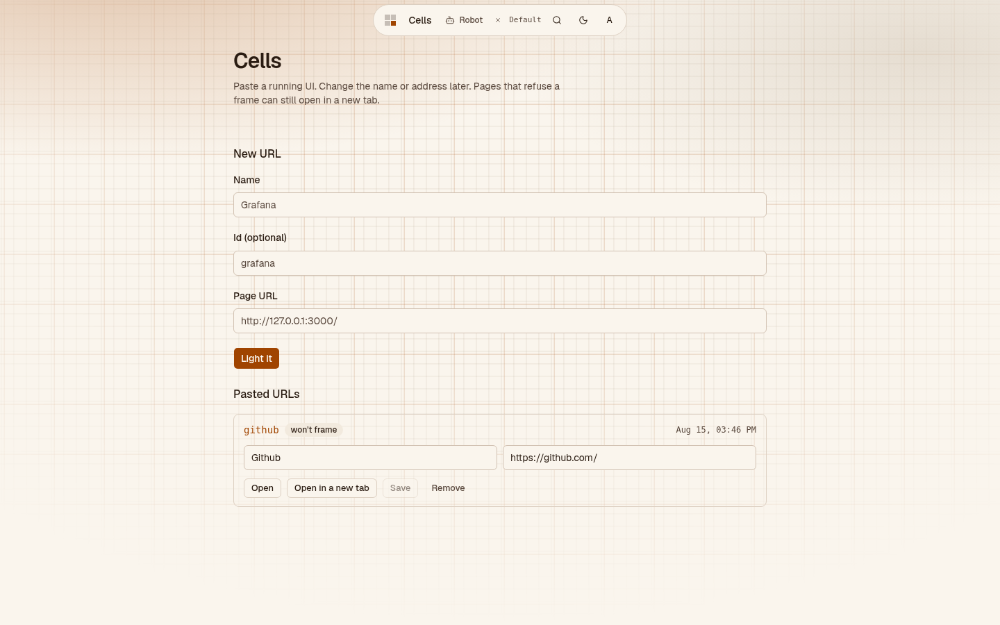

</details>

<details>
<summary>Account</summary>

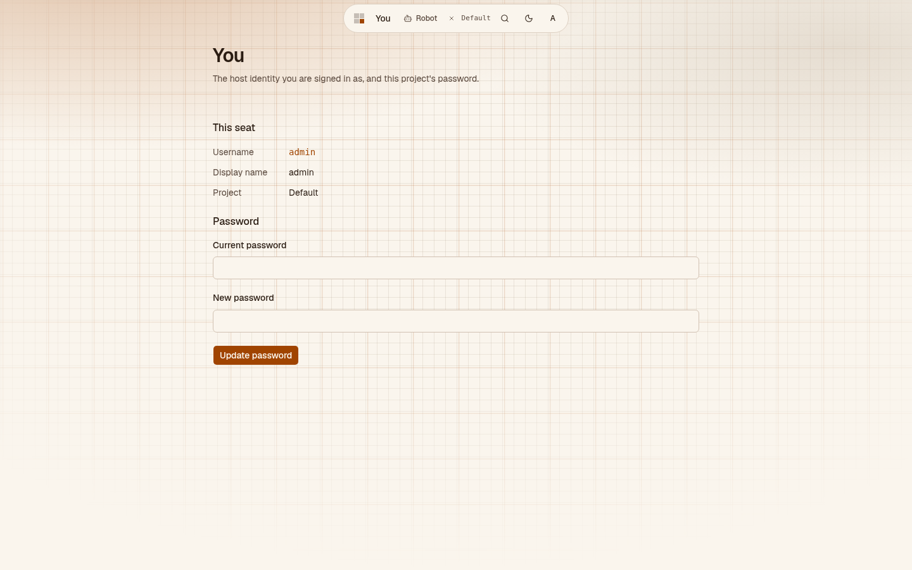

</details>

</details>

## Run locally

Needs [pnpm](https://pnpm.io) 10.

```bash
pnpm install
pnpm test
pnpm dev
```

Open [http://127.0.0.1:5178](http://127.0.0.1:5178). Dev account `admin` / `admin123`.

| Process | Port |
|---------|------|
| Shell | 5178 |
| Host API | 8788 |
| Hello plugin | 8791 |

Cluster's iframe needs a separate CiliKube (Web `8888`, API `8080` by default). Images / Train / Robot are fake-data cells and do not need real services.

To drop a cell: Remove on the floor, or the Plugins page. To take it out of this build, edit `plugins.enabled.yaml` and rebuild.

If you start the API alone, set `DAWNGRID_PLUGIN_<ID>_UPSTREAM`, `DAWNGRID_GATEWAY_SECRET`, and `DAWNGRID_JWT_ISS`. `pnpm dev` already ships those defaults.

## Layout

```
apps/api              Host API (Hono + SQLite)
apps/web              Shell (Vite + React)
packages/plugin-sdk   Plugin contract
plugins/hello         Native example
plugins/cluster       CiliKube adapter
plugins/images        Images demo
plugins/train         Train demo
plugins/robot         Robot demo
```

A new plugin needs `plugin.yaml` + `register()`, then an entry in the enabled list and `apps/web/src/plugins/catalog.ts`.
